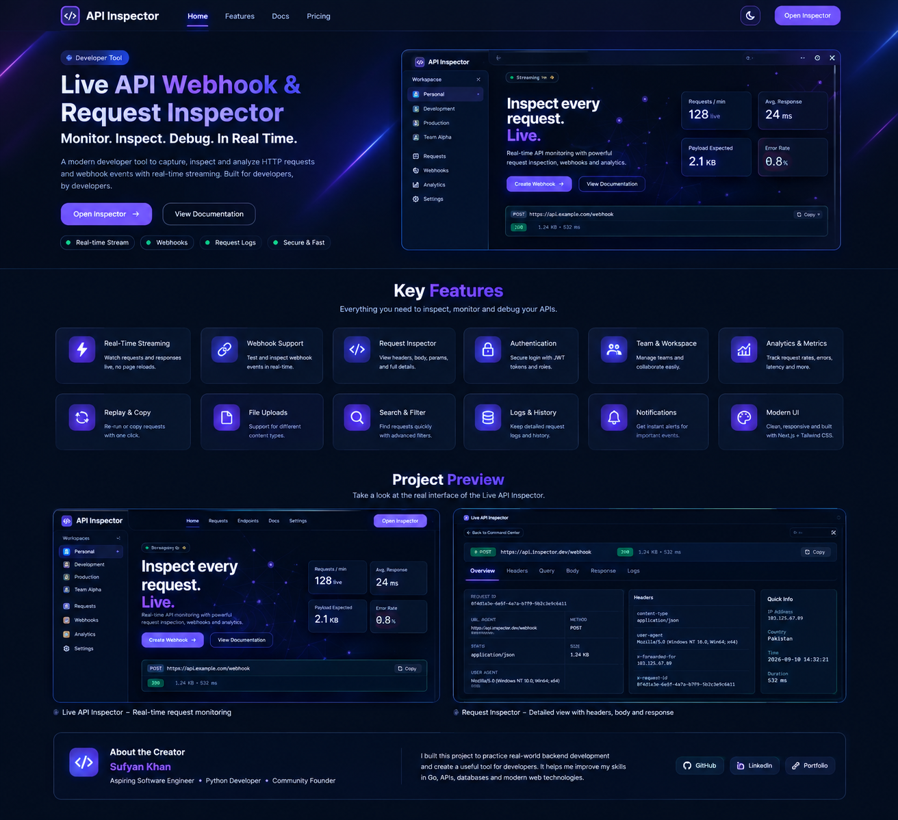

<h1 align="center">Live API Inspector</h1>

<p align="center"><em>Real-time webhook and HTTP request inspector — capture, view, and replay incoming API requests live in the browser.</em></p>

<p align="center"><strong>🚀 Current Release: V1.0.0 — Live Edition | 2026</strong></p>

<p align="center">
  
  
  
  
  
  
  
  
  
  
</p>

---

## 📌 Overview

Live API Inspector lets you spin up a public endpoint, send HTTP requests to it from anywhere (Stripe, GitHub, your own backend), and watch them appear **instantly** in your browser — no refresh, no polling.

It provides:

- Real-time request capture
- Live request stream via WebSockets
- Full request details: method, headers, body, query, timestamp
- Replay captured requests to any target URL
- Multi-endpoint support (one slug per endpoint)
- Persistent request history per endpoint
- Landing, docs, and pricing pages
- Dark, modern inspector UI
- Regenerate endpoint slug on demand
- Zero-config local setup
- Packaged Windows desktop app (Electron)

---

## 🖼️ Preview

<!-- Preview image not yet included. Add a screenshot at docs/preview.png -->

<p align="center">
  
</p>

---

## 📥 Download

Pre-built Windows executable — no Node.js installation required.

<p align="center">
  <a href="https://github.com/programmingpioneer/Live-APi-Inspector/releases/latest/download/Live-API-Inspector-Setup.exe">
    
  </a>
</p>

| Platform       | File                              | Status | Download |
| -------------- | --------------------------------- | ------ | -------- |
| Windows 64-bit | `Live-API-Inspector-Setup.exe`    | Stable | [⬇️ Download](https://github.com/programmingpioneer/Live-APi-Inspector/releases/latest/download/Live-API-Inspector-Setup.exe) |

### Run

1. Download `Live-API-Inspector-Setup.exe`
2. Run the installer (or the portable build)
3. Launch **Live API Inspector** from Start Menu
4. The desktop app opens with the inspector already running

---

## 📦 Releases

| Version | Release Date   | Status     | Download |
| ------- | -------------- | ---------- | -------- |
| v1.0.0  | September 2026 | ✅ Stable | [Live-API-Inspector-Setup.exe](https://github.com/programmingpioneer/Live-APi-Inspector/releases/latest/download/Live-API-Inspector-Setup.exe) |

---

### 📋 Changelog

See all changes in [v1.0.0](https://github.com/programmingpioneer/Live-APi-Inspector/commits/v1.0.0).

## ✨ Features

### 🔌 Endpoint Management

- Create inspector endpoints
- Auto-generated slugs
- Regenerate slug on demand
- Multiple endpoints per app
- Endpoint history persistence
- Endpoint list view

### 📡 Real-Time Capture

- Ingest any HTTP request (any method)
- Capture method, path, headers, body, query, timestamp
- Socket.IO live stream
- Zero-refresh UI updates
- Per-endpoint rooms
- Reconnect on network loss

### 🔍 Request Inspection

- Full request details panel
- Pretty-printed JSON body
- Header inspection
- Query parameter view
- Raw body view
- Empty states for no requests
- Loading skeletons

### 🔁 Replay Engine

- Replay any captured request
- Target any URL
- Real HTTP request from backend
- Replay drawer UI
- Result feedback

### 🎨 UI / UX

- Dark theme
- Responsive interface
- Landing / Docs / Pricing pages
- WebGL background on landing
- Command palette
- Toast notifications
- Smooth transitions and animations
- Reduced-motion support
- Skeleton loading states
- Accessible markup

### 🖥️ Desktop App

- Electron-wrapped desktop build
- Bundled NestJS backend
- Bundled Next.js frontend
- Single-click launch
- No terminal required
- Auto port selection
- Graceful shutdown

---

## 🛠️ Tech Stack

| Layer            | Technology                     |
| ---------------- | ------------------------------ |
| Backend          | NestJS 12                      |
| Realtime         | Socket.IO 4.8                  |
| Validation       | Zod 4                          |
| Frontend         | Next.js 16 (App Router)        |
| UI               | React 19, CSS Modules          |
| HTTP Client      | fetch + socket.io-client 4.8   |
| Storage          | Local JSON file                |
| Desktop          | Electron + electron-builder    |
| Language         | TypeScript 5.6 / TypeScript 6  |
| Runtime          | Node.js 20+                    |

---

## 📋 Requirements

- Node.js 20 or newer
- npm 10 or newer
- Git
- Windows / Linux / macOS

After dependencies are installed, the core application does **not** require any external database or cloud service.

---

## 🚀 Installation

### Windows

```powershell
git clone https://github.com/programmingpioneer/Live-APi-Inspector.git
cd Live-APi-Inspector

# backend
cd backend
npm install

# frontend
cd ..\frontend
npm install
```

### Linux / macOS

```
git clone https://github.com/programmingpioneer/Live-APi-Inspector.git
cd Live-APi-Inspector

cd backend && npm install
cd ../frontend && npm install
```

---

## 🏁 First Run

```
Start Backend
      ↓
Start Frontend
      ↓
Open Browser
      ↓
Create Endpoint
      ↓
Send Request
      ↓
Watch It Appear Live
```

### Setup Steps

1. Start the backend: `cd backend && npm run start:dev`
2. Start the frontend: `cd frontend && npm run dev`
3. Open [http://localhost:3000](http://localhost:3000)
4. Click **Create free endpoint**
5. Copy the slug
6. Send a test request (see below)
7. Watch the request appear **instantly**

---

## 🔑 Environment Variables

| Location | Variable | Purpose |
|---|---|---|
| frontend | `NEXT_PUBLIC_API_URL` | Backend base URL (default `http://localhost:4000`) |
| backend | see `backend/.env.example` | Backend runtime configuration |

Frontend template: `frontend/.env.local.example`

---

## 💾 Data Storage

### Request History

Captured requests are stored in a local JSON file:

```
backend/.devtoll-data/endpoints.json
```

### Uploaded Files

No external file uploads are used in V1.

### Backups

There is no built-in backup UI in V1 — the JSON file is portable and can be copied or versioned manually.

> Keep `.devtoll-data/` out of version control. It changes at runtime and is environment-specific.

---

## 🔒 Security

- Zod schema validation on all inbound payloads
- Backend has no auth in V1 (local-only tool)
- No credentials hard-coded into source
- No external database to protect
- Socket.IO rooms scoped by slug
- Request body size limits enforced
- CORS restricted to localhost origins in dev

```
Browser Input
     ↓
Validation
     ↓
Business Logic
     ↓
Persistence
```

The frontend is treated as untrusted for anything beyond UI state.

> **Note:** V1 is designed for **local development use**. Do not expose the backend port publicly without adding authentication.

---

## 🏗️ Architecture

```
                Client Browser
                      │
                      ▼
              Next.js Frontend :3000
                      │
       ┌──────────────┼──────────────┐
       │              │              │
       ▼              ▼              ▼
   REST API      Socket.IO      Static Pages
       │              │
       └──────┬───────┘
              ▼
        NestJS Backend :4000
              │
   ┌──────────┼──────────┐
   ▼          ▼          ▼
ingest    replay    persistence
module    module    module
              │
              ▼
      .devtoll-data/endpoints.json
```

- Frontend renders UI and holds the socket connection.
- Backend ingests incoming requests, persists them, and broadcasts to rooms.
- Persistence is a simple JSON file in V1.
- Replay makes outbound HTTP calls from the backend to the target URL.

---

## 📂 Project Structure

```
Live-APi-Inspector/
├── backend/
│   ├── src/
│   │   ├── endpoints/
│   │   │   ├── endpoints.controller.ts
│   │   │   ├── endpoints.module.ts
│   │   │   ├── endpoints.schema.ts
│   │   │   └── endpoints.service.ts
│   │   ├── gateway/
│   │   │   ├── gateway.gateway.ts
│   │   │   └── gateway.module.ts
│   │   ├── ingest/
│   │   │   ├── ingest.controller.ts
│   │   │   ├── ingest.module.ts
│   │   │   ├── ingest.service.ts
│   │   │   └── types.ts
│   │   ├── persistence/
│   │   │   ├── persistence.module.ts
│   │   │   └── persistence.service.ts
│   │   ├── replay/
│   │   │   ├── replay.controller.ts
│   │   │   ├── replay.module.ts
│   │   │   ├── replay.schema.ts
│   │   │   └── replay.service.ts
│   │   ├── app.module.ts
│   │   └── main.ts
│   ├── .env.example
│   ├── nest-cli.json
│   ├── package.json
│   └── tsconfig.json
│
├── frontend/
│   ├── app/
│   │   ├── about/
│   │   ├── changelog/
│   │   ├── contact/
│   │   ├── docs/
│   │   ├── endpoints/
│   │   ├── features/
│   │   ├── inspect/[slug]/
│   │   ├── pricing/
│   │   ├── privacy/
│   │   ├── product/
│   │   ├── terms/
│   │   ├── globals.css
│   │   ├── layout.tsx
│   │   └── page.tsx
│   ├── components/
│   │   ├── inspector/
│   │   ├── ui/
│   │   └── *.tsx
│   ├── hooks/
│   ├── lib/
│   ├── .env.local.example
│   ├── next.config.ts
│   ├── package.json
│   └── tsconfig.json
│
├── electron/
│   ├── main.js
│   ├── preload.js
│   ├── package.json
│   └── electron-builder.yml
│
├── scripts/
│   ├── build.ps1
│   ├── build-exe.ps1
│   ├── dev.ps1
│   └── README.md
│
├── docs/
│   ├── ELECTRON_BUILD.md
│   └── PUSH_AND_BUILD_GUIDE.md
│
├── .github/
│   ├── workflows/
│   ├── ISSUE_TEMPLATE/
│   └── PULL_REQUEST_TEMPLATE/
│
├── .gitignore
└── README.md
```

---

## 🔌 API Endpoints

| Method | Endpoint | Purpose |
|---|---|---|
| POST | `/api/v1/endpoints` | Create a new inspector endpoint (returns `{ slug }`) |
| POST | `/api/v1/inspect/:slug` | Ingest an incoming request |
| GET | `/api/v1/inspect/:slug/requests` | Fetch captured request history |
| POST | `/api/v1/replay` | Replay a captured request (`{ requestId, targetUrl }`) |

### Socket.IO

- Namespace: `/inspector`
- Client emits: `room:join { slug }`
- Server emits: `request:captured`

---

## 🧪 Testing

### Build Test

```
cd backend; npm run build
cd ..\frontend; npm run build
```

### Live Flow Test

```
# create endpoint
$created = Invoke-RestMethod `
    -Uri "http://localhost:4000/api/v1/endpoints" `
    -Method POST `
    -ContentType "application/json" `
    -Body "{}"

$slug = $created.slug
$slug

# open in browser
Start-Process "http://localhost:3000/inspect/$slug"

# send a test event
$body = @{ event = "payment.completed"; amount = 4999 } | ConvertTo-Json
Invoke-RestMethod `
    -Uri "http://localhost:4000/api/v1/inspect/$slug" `
    -Method POST `
    -ContentType "application/json" `
    -Body $body
```

The request must appear in the browser **instantly** — no refresh.

### Desktop App Test

```
cd scripts
.\build-exe.ps1
```

Then launch the built EXE from `electron/dist/`.

---

## 🐛 Troubleshooting

| Problem ↕▾ | Possible Solution ↕▾ |
|---|---|
| −`port 4000 already in use` | Kill the process on 4000 or change backend port |
| `port 3000 already in use` | Kill the process on 3000 or change frontend port |
| Socket does not connect | Verify `NEXT_PUBLIC_API_URL` matches the backend URL |
| Requests don't appear live | Check browser console for Socket.IO errors |
| `next build` fails on CI | Ensure `NEXT_PUBLIC_API_URL` is set at build time |
| Electron window is blank | Backend/frontend may not have started — check logs in dev console |
| EXE fails to launch | Run from terminal to see stderr, or check Windows Event Viewer |
| `.devtoll-data` file corrupt | Delete it and restart — the app recreates the file |
⚙

---

## 🗺️ Roadmap

### V1 — Local Inspector ✅

- ✅ Real-time capture
- ✅ Live socket stream
- ✅ Replay engine
- ✅ Multi-endpoint
- ✅ Persistent JSON history
- ✅ Dark UI
- ✅ Desktop app (Electron)

### V2 — Persistence & Auth

- Database-backed storage (PostgreSQL / TiDB)
- User accounts and API keys
- Per-endpoint retention policies
- Custom domains
- Request search and filters

### V3 — Cloud Platform

- Hosted inspector
- Team workspaces
- Webhook signing and verification
- Webhook forwarding rules
- Usage analytics

### Future Features

- Request diff view
- Response assertion testing
- Scheduled replays
- CLI tool
- VS Code extension
- Mobile app

---

## 📌 Release Information

### Current Release

**V1.0.0 — Live Edition**

### Release Date

**September 2026**

### Release Status

```
Stable
Local-First
Desktop-Ready
```

### What's Included in V1

- Complete live inspector
- Real-time WebSocket capture
- Replay engine
- Persistent history
- Landing / docs / pricing pages
- Dark modern UI
- Electron desktop app
- PowerShell build scripts
- GitHub CI + release workflows

### Download
<p align="center">
  <a href="https://github.com/programmingpioneer/Live-APi-Inspector/releases/latest/download/Live-API-Inspector-Setup.exe">
    
  </a>
</p>
---

## 🤝 Contributing

Contributions are welcome.

1. Fork the repository
2. Create a feature branch
3. Make your changes
4. Update documentation when required
5. Test the application
6. Commit your changes
7. Open a Pull Request

For larger changes, explain the purpose and expected behavior in the pull request.

See [`.github/CONTRIBUTING.md`](https://.github/CONTRIBUTING.md) for the full guide.

---

## 📄 License

No license specified yet.

---

## ⭐ Project Goal

Live API Inspector is built as a practical, real-world developer tool rather than a demo.

The project focuses on:

```
Real-time developer workflow
        +
Clean backend architecture
        +
Live socket streaming
        +
Practical local persistence
        +
Maintainable TypeScript
```

The long-term goal is to evolve the project from a **local inspector** into a **full cloud platform** for teams — with authentication, multi-tenant storage, and webhook forwarding.

---
<p align="center"><strong>Live API Inspector V1.0.0 — 2026</strong></p><p align="center">Made with ❤️ using NestJS, Next.js, Socket.IO & Electron.</p>